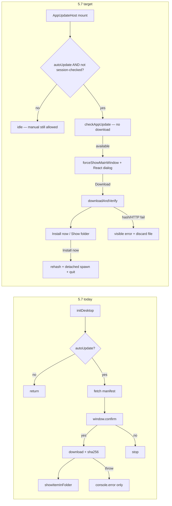
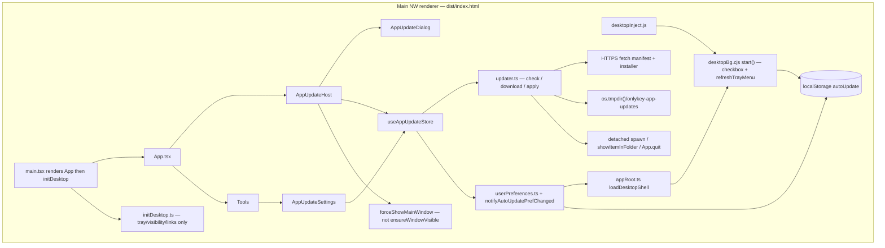
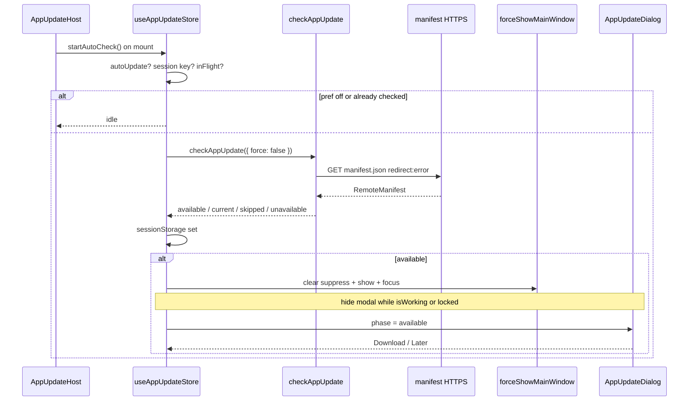
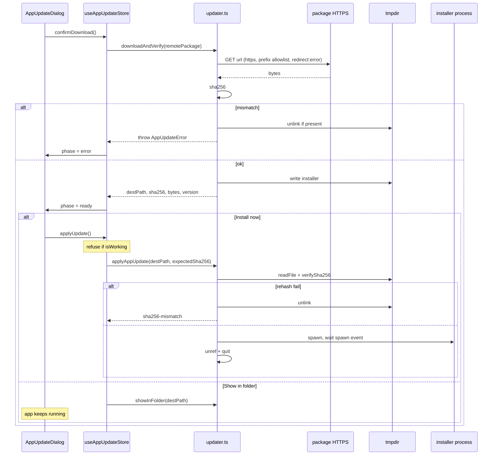

# OnlyKey App 5.7 — App auto-update (check, alert, preference, apply)

| Field | Value |
|-------|--------|
| **Author** | TBD |
| **Date** | 2026-09-10 |
| **Status** | Accepted (rev 5) |
| **Product** | OnlyKey desktop app 5.7.0 (`release/5.7.0-modern-rewrite`) |
| **Scope** | **App** updates (NW.js desktop installer). Not firmware. |
| **Runtime** | NW.js **0.104.1** (pinned; do not bump — see `docs/desktop-tray.md`) |

---

## Overview

5.7 already ships a partial app updater (`src/desktop/updater.ts`): it can fetch an HTTPS manifest, compare semver, require SHA-256, write the installer to a temp dir, and reveal it in the OS file manager. That path is not product-complete. Auto-check is gated on `userPreferences.autoUpdate` (tree today defaults **off** — a 5.7-only interlock that silently opts out 5.6 upgraders who never wrote the key), uses a blocking `window.confirm`, swallows failures at `initDesktop`, never launches the installer, and still points `manifestUrl` at the live **5.6/5.3.4** S3 channel — a channel whose published `manifest.json` has **no `sha256`**. `docs/FEATURE_PARITY_5.6.md` is stale on several of these facts.

This design brings the user-facing flow to 5.6 parity (startup check, notify, opt-out, download, **default auto-check on when the key is absent**) and then defines a 5.7 **apply** step that 5.6 never actually shipped: re-hash the on-disk installer, launch it as a **detached** OS process (NSIS `.exe` / `open` `.dmg` / `xdg-open` `.deb`), wait for the `'spawn'` event, then quit so files can be replaced. **`nw-autoupdater` stays out.** Protocol and I/O stay in typed desktop modules with injectable `AppUpdateIo`; React only renders a non-blocking dialog and a Tools settings card. The release script gains a real remote-manifest emitter (per-platform `url` + `size` + `sha256`). Safety is **fail-closed integrity** (HTTPS + required SHA-256 + path prefix), not an opt-out default. The production channel stays the existing 5.6 S3 `latest/` prefix; `release.mjs` writes local files and prints an upload reminder — no AWS credentials in this repo.

---

## Background & Motivation

### What 5.6 actually did (assumed — not in this workspace)

The following is **assumed from** trustcrypto/OnlyKey-App `master` (`app/scripts/updater.js`, `app/scripts/userPreferences.js`). Those files are **not in this repo**; do not treat them as verified tree facts.

1. No-op unless `typeof nw !== 'undefined'` and `userPreferences.autoUpdate` is true.
2. 5.6 **defaulted `autoUpdate` to true** (`getPropVal` returned `true` when the key was absent).
3. Used `nw-autoupdater` only to `readRemoteManifest()` / `checkNewVersion()` / `download()`.
4. Blocking `confirm(\`Version ${rManifest.version} is available. Do you want to download the update?\`)`.
5. Progress text in `#appUpdater` (`Downloading … N%`).
6. **In-place unpack/swap is commented out** (`updater.unpack`, `restartToSwap`). Production 5.6 ends with `nw.Shell.showItemInFolder(updateFile)` — “until installer bugs are fixed.”
7. Failures: red `App update failed` in the sidebar for 5 seconds, plus `console.error`. No rethrow to crash the UI.

So “5.6 apply” in the wild is **download + show folder**, not silent `app.nw` replacement. 5.7 must match that user-visible check/notify/opt-out/download story, then add a verified installer launch (the missing “apply”) without reintroducing `nw-autoupdater` (unfixed decompress).

### What 5.7 already has (verified in tree, 2026-09-10)

| Piece | Current truth |
|-------|----------------|
| `src/desktop/updater.ts` `checkForAppUpdate(io?: AppUpdateIo)` | One function does check + confirm + download + hash + show-folder. Early-return if `typeof nw === 'undefined'` **or** `!userPreferences.autoUpdate`. Default package read is `require(path.join(nw.App.startPath, 'package.json'))` — **broken on Finder-launched macOS** (`docs/desktop-tray.md`: `startPath` is `/`). |
| Manifest URL | `package.json` / `manifest.json` / `scripts/release.mjs` `buildProductionPackageJson` bake `https://s3.amazonaws.com/onlykey-app/releases/latest/manifest.json`. |
| Live S3 object (fetched 2026-09-10) | `{ version: "5.3.4", packages: { linux64, win64, mac64 } }` with `url` + `size` only — **no `sha256`**. HTTP 200, **no redirect**. mac filename `OnlyKey.App.5.3.4.dmg` (do not revive). |
| Integrity | HTTPS-only (`isHttpsUrl`). **Requires `remotePkg.sha256`**. Verifies SHA-256 via `js-sha256`. Manifest `size` is a progress estimate (5.6 published rounded MB, e.g. `67000000`) — **not** an integrity check. Hashes **before** write; no re-hash at apply (there is no apply). |
| Apply | Write `os.tmpdir()/onlykey-app-updates/<basename>`; `nw.Shell.showItemInFolder`. **Does not launch the installer.** |
| Errors | `console.error` then **rethrow**. `initDesktop` does `checkForAppUpdate().catch(console.error)` — user sees nothing. |
| Tests | `src/desktop/__tests__/updater.test.ts` covers helpers, autoUpdate-off, HTTPS, sha256, size, decline, missing URL. Injectable `AppUpdateIo`. |
| Pref | `src/desktop/userPreferences.ts` + `userPreferences.cjs`: `autoUpdate` **defaults false**. Tray checkbox in `desktopBg.cjs` label **"Automatically check for app updates"**. Shared `localStorage` key `autoUpdate`. CJS `autoUpdate` getter **does not re-read** storage (unlike `closeToTray`). TS getter **does** re-read. |
| Release | `scripts/release.mjs` produces `releases/OnlyKey_<ver>.exe` / `.dmg` / `_amd64.deb`. **Does not emit a remote update manifest.** |
| Firmware analog | `firmwareCheck.ts` + `promptFirmwareUpdateIfNeeded` in `useDeviceStore.ts`: session-gated (`ok-fw-checked-session`), still `window.confirm`, then `activeTab = 'firmware'`. App updater is **not** session-gated today. |
| Confirm UI | `src/components/dialogs/ConfirmDialog.tsx` exists (`z-[200]`); updater and firmware still use blocking `confirm()`. |
| App version in UI | 5.6 wrote `#appVersion` (assumed). 5.7 `App.tsx` does **not** show the desktop app version. |
| Hide-to-tray | `bindCloseToTrayOrQuit` / `desktopBg.cjs` set `localStorage.onlykeySuppressShow = '1'` and `tmp/suppress-show.json`. `ensureWindowVisible` is a **no-op** when that flag is set. Real restore is `desktopBg.cjs` `revealWindow()` (clears suppress, `setShowInTaskbar(true)`, `show(true)`). |
| Bootstrap order | `src/main.tsx` **renders `<App />` first**, then dynamically imports `initDesktop`. |
| NSIS | `resources/windows/installer.nsi`: `InstallDir $PROGRAMFILES\OnlyKey`, `RMDir /r $INSTDIR` then `File /r`. **No `RequestExecutionLevel`.** First page is directory (`MUI_PAGE_DIRECTORY`), then instfiles. |
| `nw` types | `src/types/nw.d.ts`: `Shell` has `openExternal` + `showItemInFolder` only (`openItem` untyped). `nw.App.manifest` is typed as `{ version_name: string }` only — no `version`, `manifestUrl`, or `updateBaseUrl`. |
| Vitest ui include | `src/**/*.{test,spec}.{ts,tsx}`, `src/**/*.ui.test.{ts,tsx}`, `tests/desktop/release-packaging.static.test.mjs` only. `scripts/__tests__` would **not** run. |

**Stale claims in `docs/FEATURE_PARITY_5.6.md` (must be corrected in PR 5):**

- Desktop table says updater has “No hash/signature” — **false**; SHA-256 is required in `updater.ts`.
- Same table and residual risk #2 say `autoUpdate` “Defaults **on**” — **false in today’s tree** (both TS and CJS default it **off**). That 5.7-only default-off silently opts out 5.6 upgraders who never wrote the key. This design restores **default on** (K5) so FEATURE_PARITY’s “defaults on” becomes true again after PR 2.
- Residual risk #2 “unsigned” conflates updater-protocol integrity (hash, present) with OS code-signing (Authenticode/notarization, still absent).
- Firmware row still says download-latest has “no SHA-256 check” — **false** in tree; `firmwareDownload.ts` verifies GitHub digest / release-body hash via `normalizeSha256`. Out of this feature’s runtime scope; PR 5’s doc edit must not leave that lie (fix the sentence or mark “not this PR”).

### Pain points

1. Blocking `confirm()` on the main renderer can freeze HID/setup work and is invisible or surprising when the window is hidden-to-tray (`docs/desktop-tray.md`).
2. Auto-check failures are silent; hash mismatch is a security event the user never sees.
3. “Apply” is reveal-in-folder only; NSIS `RMDir /r $INSTDIR` cannot replace a running `nw.exe`.
4. No manual “Check now”, so a user who opted out (or who was silently defaulted off by today’s 5.7 tree) has no in-app path.
5. Publishing 5.7 with auto-update on against today’s S3 manifest is a no-op (`5.3.4 < 5.7.0`) and would fail closed on missing `sha256` if a higher unhashed version were ever published.
6. `FEATURE_PARITY_5.6.md` will mislead a release reviewer if left as-is.
7. Tray CJS and React TS each cache `autoUpdate` differently; a Tools checkbox and the tray glyph will desync without a read-through + menu rebuild.
8. Default package read uses `nw.App.startPath`, which is `/` on Finder-launched macOS (`docs/desktop-tray.md`), so a packaged Mac auto-check can throw before it hits the channel.

---

## Goals & Non-Goals

### Goals

1. **Check** — automatic (preference-gated, once per process session) and manual (“Check now”, ignores the auto pref).
2. **Alert** — non-blocking React dialog; **force-show** a hide-to-tray window (clear suppress-show; do **not** call `ensureWindowVisible`); never `window.confirm` for app updates; never cover the lock-screen PIN.
3. **Preference** — keep the tray checkbox; add an in-app desktop card on **Tools** bound to the same `localStorage` key; **honor stored `'true'`/`'false'`**; if the key is **absent**, default **on** (5.6 continuity). Manual Check now ignores the pref.
4. **Apply** — re-verify SHA-256 of the on-disk file, launch the **platform installer** as a detached process, quit after `'spawn'`. Fallback: show in folder, do not quit. Never unpack `app.nw` in-process.
5. **Integrity & channel** — HTTPS only; required SHA-256; **origin + path-prefix** allowlist; release script emits the remote manifest.
6. **Modularity** — protocol in `src/desktop/updater.ts`; UI state in a dedicated Zustand store; no updater protocol in `desktopBg.cjs`; no raw HID from this feature. Auto-check is started from `AppUpdateHost`, not from `initDesktop`.
7. **Tests** — vitest unit + UI coverage of the state machine and dialogs. Do not claim live-S3 or hardware coverage.

### Non-goals

- Firmware updates (`firmwareCheck.ts`, Firmware tab, `autoUpdateFW`).
- Reintroducing `nw-autoupdater`, `node-webkit-updater`, or any in-process zip/tar unpack of the running app.
- Authenticode / Apple notarization / Debian `debsig` as part of the **updater protocol** (called out as a residual release risk, not a blocker for this design).
- Changing `installer.nsi` in the apply PR (`RequestExecutionLevel` / `nsProcess` are a **named packaging follow-up**).
- Background polling on an interval, delta patches, or silent apply with no prompt.
- Chrome App packaging (legacy). `typeof nw === 'undefined'` continues to no-op.
- Adding tray menu items (“Check now”) or moving the tray out of the main window.
- Putting app-update controls on the device Preferences tab (Tools + tray only).
- Changing the NSIS/DMG/deb **payload** format; we consume what `scripts/release.mjs` already builds.
- Modifying `../OnlyKey-Firmware`.

---

## Current vs target flow



---

## Key Decisions

### K1 — No `nw-autoupdater`, no in-process unpack

**Decision:** Keep the existing comment’s constraint. Fetch the installer as bytes (or stream-to-disk), hash it, write a regular OS installer, hand it to the OS.

**Rationale:** `nw-autoupdater` is the reason 5.7 already forked away; it pulls an unfixed decompress path. Silently replacing `app.nw` while NW is running is the same class of bug 5.6 disabled in production (assumed). The artifacts we already build are a full NSIS/DMG/deb — those are the apply mechanism.

### K2 — Check does not download; download does not apply

**Decision:** Three functions (see API). Auto-check and “Check now” only fetch + parse the manifest. Bytes move after an explicit Download click. The installer process starts only after an explicit Install now (or Show in folder).

**Rationale:** Today `checkForAppUpdate` conflates all three and uses `confirmFn` inside the protocol layer, which is untestable as UI and blocks the renderer. Splitting matches firmware’s “check then navigate” split and lets auto-check stay cheap (~JSON GET).

### K3 — Apply = re-hash on-disk file, detached-spawn the installer, then quit

**Decision:** Same process model on **all three OSes**. Never `nw.Shell.openExternal` on a filesystem path. Never use `nw.Shell.openItem` as the default apply (typed in PR 3 for completeness; default path is `child_process.spawn`).

| OS | Artifact (`scripts/release.mjs`) | Required ext | Spawn |
|----|----------------------------------|--------------|--------|
| Windows | `releases/OnlyKey_<ver>.exe` (NSIS, `$PROGRAMFILES\OnlyKey`, `RMDir /r $INSTDIR`) | `.exe` | `spawn(destPath, [], { detached: true, stdio: 'ignore', windowsHide: true, shell: false })` |
| macOS | `releases/OnlyKey_<ver>.dmg` | `.dmg` | `spawn('open', [destPath], { detached: true, stdio: 'ignore', shell: false })` |
| Linux | `releases/OnlyKey_<ver>_amd64.deb` | `.deb` | `spawn('xdg-open', [destPath], { detached: true, stdio: 'ignore', shell: false })` |

Normative state machine is in **Apply state machine** below. Summary:

1. Refuse unless `destPath` is inside `path.resolve(tmpDir)` + expected extension + no ADS/`..`.
2. `readFile` + `verifySha256`. Mismatch → **`unlinkDest`** (default `fs.unlinkSync`), `sha256-mismatch`, **no spawn, no quit**. Manifest `size` is progress-only (5.6 rounded MB); do not compare `byteLength` to it.
3. `spawnInstaller` waits on the `'spawn'` event. `'error'` → `apply-failed`, `showItemInFolder`, **no quit**.
4. On `'spawn'`: `unref()`, optional `applyDelayMs` (default 400, **0 in tests**), then `nw.App.quit()`.
5. `windowsHide: true` hides a **console** window; it must not be assumed to hide the NSIS GUI (GUI subsystem).
6. If spawn fails: `showItemInFolder` and **do not quit**. Copy includes the full `destPath`.

**UAC cancel after quit (Windows):** `installer.nsi` has **no** `RequestExecutionLevel`. Elevation often appears *after* spawn. User clicks No → app already gone; **old files on disk remain**. This is **not** a failed install. Ready-dialog copy (before they click Install now) must say: *If Windows asks for permission and you choose No, OnlyKey App will already have closed. Open it from the Start Menu. The installer file is still at `{destPath}`.*

**File locks vs quit:** Unlock of `$PROGRAMFILES\OnlyKey\nw.exe` happens only **after** `App.quit()`, while the user is typically on NSIS’s directory page (`MUI_PAGE_DIRECTORY` before `INSTFILES`). The 400 ms delay is **not** the lock mitigation; quit is. If they click Install so fast that `nw.exe` is still running, `RMDir /r` can fail partway — that is a **user-visible NSIS error**, not something we can detect after quit. Copy: *If Setup reports files in use, close OnlyKey App and run the installer from your updates folder.*

**Named packaging follow-up (not PR 3):** add `RequestExecutionLevel admin` so UAC is predictable; optionally `nsProcess` to close `nw.exe` / OnlyKey if `RMDir` would fail. Track as a separate packaging PR after Windows smoke. Do not silently hope PR 3’s delay covers it.

**macOS quit (Q3, decided):** quit after `'spawn'` of `open` on the DMG, same apply model as Windows/Linux. Drag-to-Applications can replace `OnlyKey App.app`.

**macOS/Linux no-op:** `xdg-open` / `open` can exit 0 with nothing visible. That **cannot** be detected. Ready copy always includes `destPath`. Manual smoke must include unsigned DMG / SmartScreen / pkexec. Show-in-folder fallback still works if Gatekeeper/SmartScreen blocks launch (Q2).

**Rationale:** A running `nw.exe` locks Program Files / `/opt/OnlyKey` / the `.app`. Half-applied trees are worse than show-folder. Detached spawn + `'spawn'` is the success signal; a blind sleep is not.

### K4 — Non-blocking React dialog; never `window.confirm`; never cover the PIN

**Decision:** New `AppUpdateDialog` (same visual language as `ConfirmDialog.tsx`, `z-[200]`). Mounted by `AppUpdateHost` **outside** `App.tsx`’s `sessionEpoch` remount so a device lock/unplug does not abort a download.

**Do not render the modal** (keep download in flight) while:

- `useDeviceStore.isWorking` is true (restore, firmware load, slot save), **or**
- `isConnected && isLocked` (lock-screen PIN; `LockScreen` is `z-50`).

`applyUpdate()` must also refuse while `isWorking` even if the dialog is already open.

Do **not** wait for a device to be connected — searching overlay may be up. Still allow the Tools card + manual check (sidebar is outside the lock overlay; the dialog itself stays hidden while locked so it cannot steal PIN focus).

**Before presenting**, call **`forceShowMainWindow()`** in `src/desktop/windowVisibility.ts` — **not** `ensureWindowVisible`. See **Force-show helper**.

**Rationale:** 5.6 parity of “a confirm appears” without blocking HID. Firmware still uses `confirm()` after unlock; this work does not have to fix firmware, but it must not copy that pattern or cover DUO PIN.

### K5 — Respect 5.6 auto-update preference; code default **on** when the key is absent

**Decision (final):** 5.6 defaulted `autoUpdate` **on** when `localStorage.autoUpdate` was absent, and persisted the tray checkbox in that same key. Today’s 5.7 tree defaults **off** when absent — that **silently opts out** 5.6 upgraders who never toggled the item (key never written). Restore 5.6 continuity:

1. If `localStorage.autoUpdate` is `'true'` or `'false'`, **honor it**. Never overwrite a stored choice. No migration that turns `'false'` back on.
2. If the key is **absent**, treat it as **true** (5.6 default). Fresh 5.7 installs also default **on**.
3. Flip `DEFAULTS.autoUpdate` / `userPreferences.cjs` `defaultForKey('autoUpdate')` to **`true`** in **PR 2** (with the UI work). Not gated on naming an S3 owner. Not gated on a hashed 5.7 object existing.
4. Integrity stays fail-closed, so default-on is safe against today’s unhashed 5.3.4 S3 object: remote `5.3.4 < 5.7.0` → `kind: 'current'`, no download. A newer manifest without `sha256` throws `missing-sha256` and does **not** GET the installer.
5. Channel publish stays the existing 5.6 path: `s3://onlykey-app/releases/latest/manifest.json` plus per-OS installers. `release.mjs` writes local files and prints an upload reminder. **Do not** add AWS credentials to this repo. **Do not** invent a new publisher role as a product blocker for check/alert/apply. Whoever already publishes 5.6 artifacts uploads the new objects the same way.
6. PR 5 does **not** flip the pref default (already true). PR 5 is: upload the hashed 5.7 manifest to `latest/`, record a Windows smoke (macOS/Linux noted), correct `FEATURE_PARITY_5.6.md`, tick “App update against a real 5.7 HTTPS manifest (with integrity).”
7. Tray label stays **“Automatically check for app updates.”** Manual Check now on Tools still ignores the pref (always allowed).

**Rationale:** Preference continuity is the product requirement. The safety interlock is SHA-256-required + HTTPS + path prefix, not an opt-out default that changes 5.6 users’ behavior.

### K6 — Integrity model is SHA-256 + HTTPS + origin/path-prefix, not updater-protocol signatures

**Decision:**

- Manifest URL and package URL must be `https:`.
- Fetch with `{ cache: 'no-store', redirect: 'error' }` so a 302 to `http://` cannot bypass `isHttpsUrl`. Live prod GET (2026-09-10) is HTTP 200 with **no** redirect. If staging ever 301s to `s3.<region>.amazonaws.com`, every check fails closed — operator note in PR 4/5: dump `Location` and either host on a non-redirecting URL or (only if needed) allow **HTTPS** redirects whose **final** URL still passes `isAllowedUpdateUrl`. **Do not follow HTTP.**
- `sha256` is **required** (already). Normalize with existing `normalizeSha256`. SHA-256 is the **only** payload integrity check.
- Manifest `size` is **progress-bar metadata**, matching 5.6 (`nw-autoupdater` emitted `(bytesSoFar, release.size)` and never rejected on mismatch). Live 5.3.4 uses rounded MB (`67000000` / `64000000` / `105000000`). Prefer `Content-Length` for progress when present; else `size`. Never throw on `byteLength !== size`.
- Package URL must share the **exact** hostname (no suffix match) and sit under the manifest’s origin + path prefix (see `isAllowedUpdateUrl`). That blocks `https://s3.amazonaws.com/other-bucket/malware.exe` and `https://evil.s3.amazonaws.com/…`. A fully compromised **OnlyKey** prefix still wins — residual, already in the threat table.
- On hash mismatch (download **or** apply re-hash): delete the dest file; surface a visible error; do not spawn.
- Authenticode / Apple notarization / Debian `debsig` are **not** part of the updater protocol (**Q2, decided**). Residual release risk only. Show-in-folder fallback still works if SmartScreen or Gatekeeper blocks launch.

**Rationale:** SHA-256 over HTTPS is the bar already written in `updater.ts`. Path prefix is the cheapest extra check that actually matches the threat (substituted JSON pointing at another S3 bucket).

### K7 — Updater stays in renderer TypeScript, not tray CJS

**Decision:** `src/desktop/updater.ts` + `src/store/useAppUpdateStore.ts` + React host. `desktopBg.cjs` keeps the existing checkbox **and** a tiny `refreshTrayMenu()` that **rebuilds** the tray menu from current prefs (same `assignTrayMenu(buildTrayMenu(…))` pattern already used on checkbox click). React/`Tools` **must not** `require('./desktopBg.cjs')`. Pref and force-show go through `loadDesktopShell()` in `src/desktop/appRoot.ts` (same `resolveAppRoot()` as `initDesktop.ts`). No fetch/hash/spawn in CJS. No new tray items. No `bg-script`.

**Rationale:** Tray architecture is load-bearing (`docs/desktop-tray.md`, NW 0.104.1 pin). Menu rebuild on Linux must assign a new `nw.Menu`, not `remove`/`insert`.

### K8 — When to check

**Decision:**

| Trigger | Honors `autoUpdate`? | Session gate? | Downloads? |
|---------|----------------------|---------------|------------|
| `AppUpdateHost` mount → `startAutoCheck()` | Yes; no-op if off | Yes (`sessionStorage` `ok-app-update-checked-session`) | No |
| Manual “Check now” | **No** (always allowed) | No (always hits the network) | No |
| Interval / alarm | **Not implemented** | — | — |
| Tray checkbox click | No check (pref write + menu rebuild) | — | — |
| `initDesktop` | **Does not start the check** after PR 2 | — | — |

`src/main.tsx` renders `<App />` **before** dynamically importing `initDesktop`. `AppUpdateHost` is therefore the once-per-mount caller. StrictMode double-mount is absorbed by the in-flight mutex.

Session gate marks “we already auto-checked this process,” including decline. Hide-to-tray does **not** clear `sessionStorage`. If the result was `available` but the dialog was deferred (PIN / `isWorking`), keep `phase = 'available'` and present when deferral clears — do not require the user to have *seen* the dialog for the session key to be set.

No interval: 5.6 had none (assumed); this is a config app, not an always-on daemon.

### K9 — In-app surface is Tools + tray + sidebar version (not Preferences)

**Decision:** Extract `AppUpdateSettings` (current version, checkbox bound to `userPreferences.autoUpdate`, Check now, last result/error). Place it on **Tools** only — the only tab `App.tsx` leaves usable while disconnected (`activeTab !== 'tools'` overlay). Tray checkbox remains. Sidebar footer shows `App v{version}` (5.6 `#appVersion` parity, assumed).

Do **not** add a “This computer” row to device Preferences (`setTypeSpeed`, layouts, wipe mode). That tab `return null` without a device and would be read as a device pref. Dual surfaces also widen the tray/React desync (K7). **Q4, decided:** Tools + tray only. No Preferences tab row. No “tray only.”

### K10 — 5.6 ↔ 5.7 channel coexistence

**Decision:** Keep the production URL `https://s3.amazonaws.com/onlykey-app/releases/latest/manifest.json`. Extra JSON fields (`sha256`) are ignored by 5.6 `nw-autoupdater` (assumed). When we publish a 5.7.x manifest:

- 5.6 clients with auto-update on will see a newer version, download the installer, and **show in folder** (their production apply). That is the upgrade ramp.
- 5.7 clients against the **current** 5.3.4 object: `compareSemver('5.3.4','5.7.0') < 0` → `kind: 'current'`. Missing `sha256` is only fatal if we would download.
- 5.7 clients against a newer manifest **without** `sha256`: check returns throw `missing-sha256` (no installer GET). Closed-fail.

Do **not** put 5.7-only keys that would make 5.6 `readRemoteManifest` throw. Stick to `{ version, packages: { win64|mac64|linux64: { url, size, sha256 } } }` plus optional unused fields (`name`, `productName`, `publishedAt`).

Staging: pack-time `ONLYKEY_UPDATE_MANIFEST_URL` (and matching `ONLYKEY_UPDATE_BASE_URL` for artifact links) override `manifest.json`. Default remains the live S3 URL.

---

## Proposed Design

### Architecture



`useDeviceStore` is not extended. Device I/O stays behind `OnlyKeyDevice`. Cross-store reads from `AppUpdateHost` / `applyUpdate`: `isWorking`, `isConnected`, `isLocked` (deferral + refuse apply). One-way.

### Sequence — auto-check (no download)



### Sequence — download + apply



### Shared desktop-shell loader (`src/desktop/appRoot.ts`)

`desktopBg.cjs` is a packaged sibling of `package.json`, not a Vite input. `desktopInject.js` loads it from the app root; `initDesktop.ts` already uses `resolveAppRoot()` (probe `nw.App.startPath` / macOS `Contents/Resources/app.nw` / `dirname(execPath)` / `cwd`, first dir that contains `desktopBg.cjs`). **No** `src/` or `dist/assets/` file may `require('./desktopBg.cjs')`.

PR 1 extracts the existing `resolveAppRoot` from `initDesktop.ts` into `src/desktop/appRoot.ts` so `readLocalAppPackage` can use it (never `startPath` alone). PR 2 adds `loadDesktopShell()` to the same file. `initDesktop.ensureDesktopStarted` then calls `loadDesktopShell()?.start?.()`.

```ts
export function resolveAppRoot(): string {
  // identical candidate list to today's initDesktop.ts resolveAppRoot
}

export type DesktopShell = {
  start?: () => void;
  refreshTrayMenu?: () => void;
  setSuppressShow?: (value: boolean) => void;
};

/** `null` when `typeof nw === 'undefined'` or require fails (unit tests, Chrome). */
export function loadDesktopShell(): DesktopShell | null {
  if (typeof nw === 'undefined') return null;
  try {
    const path = require('path') as typeof import('path');
    return require(path.join(resolveAppRoot(), 'desktopBg.cjs')) as DesktopShell;
  } catch {
    return null;
  }
}
```

Unit tests mock `loadDesktopShell` (or `notifyAutoUpdatePrefChanged`), **not** the CJS file.

### Force-show helper

`ensureWindowVisible` in `src/desktop/windowVisibility.ts` returns immediately when `localStorage.onlykeySuppressShow === '1'` or `tmp/suppress-show.json` exists. Hide-to-tray **sets both** (`bindCloseToTrayOrQuit`, `desktopBg.cjs` `setSuppressShow(true)`). Tests lock this in (`windowVisibility.test.ts`: “skips show when onlykeySuppressShow is set”). Calling it from `AppUpdateHost` would leave the window hidden.

`revealWindow()` does **not** unlink `nw.App.startPath/tmp/suppress-show.json`. It calls `setSuppressShow(false)`, which unlinks `path.join(tmpDir(), 'suppress-show.json')`. `tmpDir()` is the first **writable** of `resolveAppRoot()/tmp`, `~/.config/OnlyKey/app-tmp`, `os.tmpdir()/onlykey-app` — installed copies under `/Applications`, `/opt/OnlyKey`, and `$PROGRAMFILES\OnlyKey` cannot write the app-root tmp.

Add **`forceShowMainWindow(win)`** in `src/desktop/windowVisibility.ts`. Add `setShowInTaskbar?: (show: boolean) => void` to the local `NwWindow` type (already on `src/types/nw.d.ts`, missing from that alias). Clear suppress-show via the **same** `setSuppressShow(false)` as `revealWindow`:

```ts
export function forceShowMainWindow(win: NwWindow): void {
  win._onlykeySuppressShow = false;
  const shell = loadDesktopShell();
  if (shell?.setSuppressShow) {
    shell.setSuppressShow(false); // localStorage + tmpDir()/suppress-show.json
  } else {
    try {
      localStorage.removeItem('onlykeySuppressShow');
    } catch { /* ignore */ }
  }
  try {
    if (win.isMinimized && win.restore) win.restore();
  } catch { /* ignore */ }
  try {
    win.setShowInTaskbar?.(true);
  } catch { /* ignore */ }
  win.show(true);
  win.focus();
}
```

- `AppUpdateHost` calls this when transitioning to a presentable `available` / security-error / manual `up-to-date` / manual error.
- Do **not** call `ensureWindowVisible` for this.
- `ensureWindowVisible` stays as-is for startup/focus (must keep skipping suppress-show, or hide-to-tray will fight the user). Do **not** expand its `startPath/tmp` probe in this feature.
- Unit test: mock `loadDesktopShell` so `setSuppressShow(false)` is invoked; window `show(true)` / `focus` / `setShowInTaskbar(true)` run; `ensureWindowVisible` still no-ops when suppress-show is set.
- Do **not** `dispatchTrayCommand('show')` — that is tray IPC. This helper is the allowed reveal API.
- PR 2 includes this file + tests.

### Apply state machine

Default `spawnInstaller` and `applyAppUpdate` (normative). `applyAppUpdate` is **unused in PR 1–2** (`throw` if called, or omit until PR 3 — do **not** alias it to show-folder).

The store calls `applyAppUpdate(destPath, expected)` with **empty** `io`. Optional `io.unlink?.()` is therefore a production no-op. Every mismatch path in `downloadAndVerify` **and** `applyAppUpdate` must go through `unlinkDest`, which defaults to `fs.unlinkSync`:

```ts
function unlinkDest(destPath: string, io: AppUpdateIo): void {
  try {
    (io.unlink ?? ((p) => require('fs').unlinkSync(p)))(destPath);
  } catch {
    /* ignore — still throw the integrity error to the caller */
  }
}
```

```ts
const INSTALLER_EXT: Record<string, string> = {
  win32: '.exe',
  darwin: '.dmg',
  linux: '.deb',
};

export function assertSafeUpdatePath(
  destPath: string,
  tmpDir: string,
  platform: NodeJS.Platform,
): string {
  const resolved = path.resolve(destPath);
  const root = path.resolve(tmpDir);
  const prefix = root.endsWith(path.sep) ? root : root + path.sep;
  if (resolved !== root && !resolved.startsWith(prefix)) {
    throw new AppUpdateError('Installer path is outside the updates directory.', 'io');
  }
  const base = path.basename(resolved);
  if (base.includes(':') || base.includes('\0') || base === '..' || base === '.') {
    throw new AppUpdateError('Installer path is not allowed.', 'io');
  }
  const expected = INSTALLER_EXT[platform];
  if (!expected || path.extname(resolved).toLowerCase() !== expected) {
    throw new AppUpdateError('Installer file type does not match this OS.', 'io');
  }
  return resolved;
}

function defaultSpawnInstaller(destPath: string, platform: NodeJS.Platform): Promise<void> {
  const { spawn } = require('child_process') as typeof import('child_process');
  const cmd = platform === 'win32' ? destPath : platform === 'darwin' ? 'open' : 'xdg-open';
  const args = platform === 'win32' ? [] : [destPath];
  return new Promise((resolve, reject) => {
    let settled = false;
    const child = spawn(cmd, args, {
      detached: true,
      stdio: 'ignore',
      windowsHide: true, // console only; NSIS GUI still shows
      shell: false,
    });
    child.once('error', (err) => {
      if (settled) return;
      settled = true;
      reject(err);
    });
    child.once('spawn', () => {
      if (settled) return;
      settled = true;
      child.unref();
      resolve();
    });
  });
}

export async function applyAppUpdate(
  destPath: string,
  expected: { sha256: string; bytes?: number },
  io: AppUpdateIo = {},
): Promise<void> {
  const platform = io.platform?.() ?? process.platform;
  const tmp = io.tmpDir?.() ?? path.join(require('os').tmpdir(), 'onlykey-app-updates');
  const safe = assertSafeUpdatePath(destPath, tmp, platform);

  let body: Uint8Array;
  try {
    body = io.readFile?.(safe) ?? new Uint8Array(require('fs').readFileSync(safe));
  } catch {
    throw new AppUpdateError('Could not read the downloaded installer.', 'io');
  }
  try {
    verifySha256(body, expected.sha256);
  } catch {
    unlinkDest(safe, io);
    throw new AppUpdateError('Update package SHA-256 does not match the manifest.', 'sha256-mismatch');
  }

  try {
    await (io.spawnInstaller ?? defaultSpawnInstaller)(safe, platform);
  } catch {
    (io.showInFolder ?? ((p) => nw.Shell.showItemInFolder(p)))(safe);
    throw new AppUpdateError('Could not open the installer.', 'apply-failed');
  }

  const delay = io.applyDelayMs ?? 400;
  if (delay > 0) await new Promise((r) => setTimeout(r, delay));
  (io.quitApp ?? (() => nw.App.quit()))();
}
```

`downloadAndVerify` uses the same `unlinkDest` after a sha256 failure (including the stream-to-disk path that hashes after write). Tests 17 / 19b inject `io.unlink` and assert it was called; production with empty `io` still deletes via `fs.unlinkSync`. Test 16: rounded `size` still succeeds when the hash matches.

`AppUpdateIo.spawnInstaller` in tests: resolve on call (simulates `'spawn'`). A separate test rejects to cover `apply-failed` (show-folder, no quit).

### Module layout (files)

| File | Role |
|------|------|
| `src/desktop/updater.ts` | Protocol: compare, URL prefix checks, `checkAppUpdate`, `downloadAndVerify`, `applyAppUpdate` (PR 3), `showUpdateInFolder`, `assertSafeUpdatePath`, **`unlinkDest`**. Typed errors. Injectable `AppUpdateIo`. Keep `compareSemver` / `isHttpsUrl` / `normalizeSha256` / `verifySha256` (firmware download imports `normalizeSha256`). |
| `src/desktop/appRoot.ts` | **PR 1:** extract `resolveAppRoot` from `initDesktop.ts` (same candidate list). **PR 2:** add `loadDesktopShell()`. |
| `src/desktop/windowVisibility.ts` | Add `forceShowMainWindow` (clears suppress via `loadDesktopShell()?.setSuppressShow(false)`). Add `setShowInTaskbar?` to local `NwWindow`. Leave `ensureWindowVisible` behavior unchanged. |
| `src/store/useAppUpdateStore.ts` | Zustand phase machine + `autoCheck` mirror. **No fetch in React.** |
| `src/components/dialogs/AppUpdateDialog.tsx` | Available / downloading / ready / error / up-to-date (manual). |
| `src/components/AppUpdateHost.tsx` | Mount-time `startAutoCheck()`; deferral vs `isWorking` / lock; `forceShowMainWindow`; renders dialog. Mounted in `App.tsx` **outside** `key={sessionEpoch}`. |
| `src/components/AppUpdateSettings.tsx` | Checkbox + Check now + version + last error. Used by **Tools only**. Subscribes to `autoCheck`. |
| `src/components/Tools.tsx` | New “OnlyKey App” section (disconnected-safe). |
| `src/App.tsx` | `AppUpdateHost` + sidebar `App v…`. |
| `src/desktop/initDesktop.ts` | After PR 2: **no** updater call. Uses `loadDesktopShell()?.start?.()`. Tray / visibility / link handlers only. |
| `src/types/nw.d.ts` | **PR 1:** extend `nw.App.manifest` with `version?`, `manifestUrl?`, `updateBaseUrl?` (keep `version_name`). **PR 3:** add `Shell.openItem`. |
| `src/desktop/userPreferences.ts` / `userPreferences.cjs` | CJS `autoUpdate` getter re-reads like `closeToTray` (PR 2). TS: `notifyAutoUpdatePrefChanged()`. **PR 2:** `DEFAULTS.autoUpdate` / `defaultForKey('autoUpdate')` → **`true`**. Stored `'false'` still wins. |
| `desktopBg.cjs` | Checkbox unchanged; export `refreshTrayMenu()` (no-op if `!state.tray`) and keep exporting `setSuppressShow`; stash `autoLaunch` on `state` in `initTray`. |
| `scripts/release.mjs` | After artifact build, write platform fragment + merged local manifest. |
| `scripts/update-manifest.mjs` | Hash/size, merge `releases/update-manifest.d/*.json`, emit `releases/manifest.json`. |
| `manifest.json` | Pack-time `manifestUrl` (overridable by env). |
| `docs/FEATURE_PARITY_5.6.md` | Correct stale updater **and** firmware-download hash rows; tick the gate when smoke-tested. |

Thin compatibility: keep exporting `checkForAppUpdate` through PR 1 as a wrapper so existing tests/`initDesktop` stay stable. Delete the wrapper in PR 2; `initDesktop` drops the call; `AppUpdateHost` owns startup.

### Preference sync (tray vs Tools)

Two modules, one `localStorage` key:

| Writer | Module | Today |
|--------|--------|--------|
| Tray checkbox | `userPreferences.cjs` | Caches `_autoUpdate` at construct; **getter does not re-read** (unlike `closeToTray`) |
| Tools / updater | `src/desktop/userPreferences.ts` | Getter **does** re-read `localStorage` every time |
| Same document | — | `storage` events do **not** fire |

**Required in PR 2:**

1. CJS `get autoUpdate()` re-reads via `readPreference('autoUpdate')` (copy the `closeToTray` getter). Same for `autoUpdateFW` while touching the file (cheap consistency; not required for this feature).
2. Restore Zustand **`autoCheck: boolean`** as a **mirror**, not the source of truth. `hydrateAutoUpdate()` does `set({ autoCheck: userPreferences.autoUpdate })`. `AppUpdateSettings` subscribes to `autoCheck` so a tray toggle re-renders the checkbox. Call `hydrateAutoUpdate` from Host/Settings on mount, `window` `focus`, and `onlykey-autoUpdate-changed`. Do **not** read `userPreferences.autoUpdate` only inline (nothing else would re-render).
3. Add `notifyAutoUpdatePrefChanged()` in `src/desktop/userPreferences.ts`:

```ts
export const AUTO_UPDATE_PREF_EVENT = 'onlykey-autoUpdate-changed';

export function notifyAutoUpdatePrefChanged(): void {
  try {
    window.dispatchEvent(new Event(AUTO_UPDATE_PREF_EVENT));
  } catch { /* ignore */ }
  loadDesktopShell()?.refreshTrayMenu?.();
}
```

TS `set('autoUpdate', …)` and store `setAutoUpdate` call this after writing `localStorage`. CJS setter dispatches the same event when `window` exists (tray click already rebuilds its own menu). **React never `require`s `desktopBg.cjs`.** `refreshTrayMenu` no-ops if `!state.tray`.

4. `refreshTrayMenu` rebuilds via `assignTrayMenu(buildTrayMenu(state.autoLaunch))` — store the AutoLaunch instance on `state` in `initTray` (today it is a local `let`). Linux: rebuild a **new** menu; do not `remove`/`insert`.
5. Tray click already rebuilds the menu after toggling CJS; the custom event hydrates React (`autoCheck` mirror).

### Dialog copy (user-facing)

Keep 5.6’s voice (assumed), add the current version:

- **Available:** title `App update available`. Body `Version {latest} is available. You have {current}. Download the update?` Buttons: `Download` / `Later`.
- **Downloading:** `Downloading {latest}… {n}%` (percent if `Content-Length` or manifest `size` is known; otherwise indeterminate). No cancel in v1. Later disabled while bytes are in flight. Abort the `fetch` `AbortSignal` on `nw.Window` `'close'` / `nw.App.quit` if a download is running (quit during download must not leave a wedged GET).
- **Ready (PR 2):** `Version {latest} was downloaded and verified (SHA-256).` Buttons: `Show in folder` / `OK`. No Install now yet.
- **Ready (PR 3):** `Version {latest} was downloaded and verified (SHA-256). Install now? The app will quit so the installer can replace files. If Windows asks for permission and you choose No, open OnlyKey App from the Start Menu — the installer is still at {destPath}. If Setup says files are in use, close the app and run that file.` Buttons: `Install now` / `Show in folder`.
- **Up to date** (manual only): `OnlyKey App {current} is up to date.` Button: `OK`.
- **Later / dismiss:** close dialog; auto-check will not re-prompt this session.
- **Errors** — see table below. Always include `destPath` in `apply-failed` copy.

Do **not** reuse `WorkingDialog` (“Do not remove your OnlyKey”). That overlay is for device ops (`z-[250]`).

### Check result vs UI (single table)

`checkAppUpdate` **returns** a result for expected channel outcomes. It **throws** `AppUpdateError` only for parse / transport / integrity.

```ts
export type AppUpdateCheckResult =
  | { kind: 'skipped'; reason: 'not-desktop' | 'pref-disabled' | 'already-checked' }
  | { kind: 'current'; currentVersion: string; latestVersion: string }
  | {
      kind: 'available';
      currentVersion: string;
      latestVersion: string;
      platformKey: PlatformPackageKey;
      remotePackage: { url: string; sha256: string; size?: number };
      manifestUrl: string;
    }
  | {
      kind: 'unavailable';
      code: 'missing-platform';
      currentVersion: string;
      latestVersion: string;
    };
```

| Condition | Protocol | Auto UI | Manual UI |
|-----------|----------|---------|-----------|
| Not desktop | `skipped not-desktop` | idle | n/a |
| Pref off, `force` false | `skipped pref-disabled` | idle | n/a |
| Session key, `force` false | `skipped already-checked` | idle | n/a |
| Remote ≤ current | `current` | idle | `up-to-date` modal |
| Newer + HTTPS URL + sha256 + prefix OK | `available` | modal when not deferred | modal |
| Newer, no package for this OS | `unavailable missing-platform` | idle + `console.error` | error modal |
| Newer, package missing `sha256` | **throw** `missing-sha256` | error modal (security) | error modal |
| Non-HTTPS / prefix fail | **throw** `not-https` / `host-not-allowed` | error modal (security) | error modal |
| HTTP / TypeError / bad JSON on manifest | **throw** `http-manifest` / `invalid-manifest` / `io` | **phase `error`, `promptVisible` false**, Tools line + console | error modal |
| Package GET fail | **throw** `http-package` | error modal | error modal |
| sha256 at download or apply | **throw** `sha256-mismatch` | error modal; `unlinkDest` | error modal; `unlinkDest` |
| Spawn `'error'` | **throw** `apply-failed` | error modal; show folder; no quit | same |

Copy:

| Code | User string |
|------|-------------|
| `http-manifest` / `http-package` | `Could not reach the update server (HTTP {status}).` |
| `invalid-manifest` | `The update manifest was not valid JSON.` |
| `io` | `Could not read or write the update files.` |
| `not-https` / `host-not-allowed` | `Update refused: the download location is not an allowed HTTPS path.` |
| `missing-sha256` | `The update manifest did not include a SHA-256 checksum. The download was not started.` |
| `sha256-mismatch` | `The downloaded installer failed integrity verification (SHA-256). The file was discarded.` |
| `missing-platform` | `No installer is published for this operating system yet.` |
| `apply-failed` | `Could not open the installer. It is still at {destPath}.` |
| `not-desktop` | not shown (Chrome / tests) |

### Hidden-to-tray

`docs/desktop-tray.md`: Chromium may throttle a hidden main renderer; `chromium-args` already disable background throttling. Auto-check runs at `AppUpdateHost` mount (first paint) — typically **before** hide. If a check is still in flight after hide:

1. Complete the JSON fetch in the background.
2. On `available` (or security error / manual result that needs a modal), `forceShowMainWindow` then present when not deferred.
3. Never call `window.confirm` or `ensureWindowVisible`.

No extra tray IPC. Updater does not call `dispatchTrayCommand`.

### In-flight mutex and abort

Firmware uses `firmwareCheckInFlight`. App store:

- Module-level / store `inFlight: boolean` (or a `Promise` slot).
- `startAutoCheck` / `checkNow`: if `inFlight` or `phase` is `checking | downloading | applying`, return.
- Disable Check now while those phases.
- `confirmDownload` / `applyUpdate`: no-op if `inFlight` or wrong phase.
- `applyUpdate` additionally no-ops if `useDeviceStore.getState().isWorking`.
- Hold an `AbortController` on the store during fetch. Abort on window `'close'` and before `quitApp` if still downloading. v1 still has **no user Cancel** button.
- 10 min package timeout via `AbortSignal.timeout` (or combined signal). Surface as `http-package`. Manifest timeout 15 s → `http-manifest`.

### Progress

5.6 used `nw-autoupdater` `"download"` events (assumed). `fetch()` + `arrayBuffer()` has no progress.

1. Prefer `response.body.getReader()` and accumulate (or write chunks to disk, then read back for hash). Report `received / expected` where `expected = Content-Length if present, else remotePkg.size` (progress estimate only).
2. If the reader path is awkward under happy-dom, keep `arrayBuffer()` as default `fetchFn` behavior and expose `onProgress` on `AppUpdateIo`. Production should stream when `body` exists.

Expected payload size (live 5.3.4): Windows ~67 MB, Linux ~64 MB, macOS ~105 MB. Holding ~100 MB in RAM for hash is acceptable; do not invent a streaming hasher in PR 1.

---

## API / Interface Changes

All of this lives in `src/desktop/updater.ts` unless noted. Names are normative.

```ts
export const DEFAULT_MANIFEST_URL =
  'https://s3.amazonaws.com/onlykey-app/releases/latest/manifest.json';

export const APP_UPDATE_SESSION_KEY = 'ok-app-update-checked-session';

export interface RemotePackage {
  url: string;
  size?: number;
  sha256?: string;
}

export interface RemoteManifest {
  version: string;
  packages?: Record<string, RemotePackage>;
}

export type PlatformPackageKey = 'win64' | 'mac64' | 'linux64';

export class AppUpdateError extends Error {
  constructor(
    message: string,
    readonly code:
      | 'not-https'
      | 'host-not-allowed'
      | 'http-manifest'
      | 'http-package'
      | 'invalid-manifest'
      | 'missing-sha256'
      | 'sha256-mismatch'
      | 'io'
      | 'apply-failed',
    readonly httpStatus?: number,
  ) {
    super(message);
    this.name = 'AppUpdateError';
  }
}

export interface AppUpdateIo {
  fetchFn?: typeof fetch;
  readPackage?: () => {
    version?: string;
    version_name?: string;
    manifestUrl?: string;
    updateBaseUrl?: string;
  };
  /** Test seam; production uses `resolveAppRoot()` from `appRoot.ts`. */
  resolveAppRoot?: () => string;
  writeFile?: (destPath: string, data: Uint8Array) => void;
  readFile?: (destPath: string) => Uint8Array;
  unlink?: (destPath: string) => void;
  tmpDir?: () => string;
  showInFolder?: (destPath: string) => void;
  spawnInstaller?: (destPath: string, platform: NodeJS.Platform) => Promise<void>;
  quitApp?: () => void;
  platform?: () => NodeJS.Platform;
  sessionGet?: (key: string) => string | null;
  sessionSet?: (key: string, value: string) => void;
  isDesktop?: () => boolean;          // default: typeof nw !== 'undefined'
  autoUpdateEnabled?: () => boolean;  // default: userPreferences.autoUpdate
  onProgress?: (received: number, total: number | null) => void;
  applyDelayMs?: number;              // default 400; 0 in tests
  abortSignal?: AbortSignal;
}

export function checkAppUpdate(
  io?: AppUpdateIo,
  opts?: { force?: boolean },
): Promise<AppUpdateCheckResult>;

export function downloadAndVerify(
  latestVersion: string,
  remotePackage: { url: string; sha256: string; size?: number },
  io?: AppUpdateIo,
): Promise<AppUpdateDownloadResult>;

export interface AppUpdateDownloadResult {
  destPath: string;
  version: string;
  sha256: string;
  bytes: number;
}

export function applyAppUpdate(
  destPath: string,
  expected: { sha256: string; bytes?: number },
  io?: AppUpdateIo,
): Promise<void>;

export function showUpdateInFolder(destPath: string, io?: AppUpdateIo): void;

/** PR 1 wrapper only — delete in PR 2. */
export function checkForAppUpdate(io?: AppUpdateIo): Promise<void>;
```

Path-prefix helper (unit-tested). No blanket `s3.amazonaws.com` host allowlist.

```ts
/** Directory of the manifest, always with a trailing slash. */
export function updateUrlPrefix(manifestUrl: string, baseUrl?: string): string {
  const raw = baseUrl && baseUrl.length > 0 ? baseUrl : manifestUrl.replace(/\/[^/]*$/, '/');
  return raw.endsWith('/') ? raw : `${raw}/`;
}

export function isAllowedUpdateUrl(
  url: string,
  manifestUrl: string,
  baseUrl?: string,
): boolean {
  if (!isHttpsUrl(url) || !isHttpsUrl(manifestUrl)) return false;
  if (baseUrl && !isHttpsUrl(baseUrl)) return false;
  const u = new URL(url);
  const prefix = new URL(updateUrlPrefix(manifestUrl, baseUrl));
  if (u.protocol !== 'https:' || prefix.protocol !== 'https:') return false;
  if (u.hostname !== prefix.hostname) return false; // exact; no suffix match
  if (u.port !== prefix.port) return false;
  const prefixPath = prefix.pathname.endsWith('/') ? prefix.pathname : `${prefix.pathname}/`;
  return u.pathname.startsWith(prefixPath);
}
```

Default prefix for `https://s3.amazonaws.com/onlykey-app/releases/latest/manifest.json` is `https://s3.amazonaws.com/onlykey-app/releases/latest/` — live 5.3.4 package URLs already live in that directory. Staging: pass `ONLYKEY_UPDATE_BASE_URL` (must be a directory URL). Packaged `package.json` may include `updateBaseUrl` next to `manifestUrl` if env was set; otherwise derive from `manifestUrl`.

`readLocalAppPackage` returns `{ version, manifestUrl, updateBaseUrl? }` from `nw.App.manifest` and/or `resolveAppRoot()/package.json` (see API). `checkAppUpdate` / `downloadAndVerify` pass `updateBaseUrl` into `isAllowedUpdateUrl`.

Zustand store:

```ts
export type AppUpdatePhase =
  | 'idle'
  | 'checking'
  | 'available'
  | 'downloading'
  | 'ready'
  | 'applying'
  | 'up-to-date'
  | 'error';

export interface AppUpdateState {
  phase: AppUpdatePhase;
  currentVersion: string | null;
  latestVersion: string | null;
  error: string | null;
  errorCode: AppUpdateError['code'] | 'missing-platform' | null;
  destPath: string | null;
  expectedSha256: string | null;
  expectedBytes: number | null;
  downloadReceived: number;
  downloadTotal: number | null;
  lastCheckKind: AppUpdateCheckResult['kind'] | null;
  promptVisible: boolean;
  /** Mirror of `userPreferences.autoUpdate`. Source of truth stays localStorage. */
  autoCheck: boolean;
}

export interface AppUpdateStore extends AppUpdateState {
  startAutoCheck: () => Promise<void>;
  checkNow: () => Promise<void>;
  confirmDownload: () => Promise<void>;
  applyUpdate: () => Promise<void>;
  revealUpdate: () => void;
  dismiss: () => void;
  setAutoUpdate: (value: boolean) => void;
  hydrateAutoUpdate: () => void;
}

// hydrateAutoUpdate: set({ autoCheck: userPreferences.autoUpdate })
// setAutoUpdate(v): userPreferences.autoUpdate = v; notifyAutoUpdatePrefChanged(); set({ autoCheck: v })
```

`AUTO_UPDATE_PREF_EVENT` and `notifyAutoUpdatePrefChanged` live in `userPreferences.ts` (updater does not own the pref event).

`confirmFn` is **removed** from `AppUpdateIo` in PR 2. PR 1 may keep it on the compatibility wrapper only.

`initDesktop.ts` after PR 2 does **not** import the store. `ensureDesktopStarted` uses `loadDesktopShell()?.start?.()` (same `resolveAppRoot` as today):

```ts
export async function initDesktop(): Promise<void> {
  ensureDesktopStarted();
  const win = nw.Window.get();
  bindWindowVisibilityHandlers(win);
  // ... existing timeout, http link handler ...
  // no startAutoCheck — AppUpdateHost owns that
}
```

`AppUpdateHost`:

```tsx
useEffect(() => {
  void useAppUpdateStore.getState().startAutoCheck();
}, []);
```

Sidebar version helper — **must not** `require(path.join(nw.App.startPath, 'package.json'))`. Finder-launched macOS sets `startPath` to `/` (`docs/desktop-tray.md`); that is why `resolveAppRoot()` exists. NW already exposes the packaged `package.json` as `nw.App.manifest`.

```ts
export type LocalAppPackage = {
  version: string;
  manifestUrl: string;
  updateBaseUrl?: string;
};

function isUsableAppRoot(dir: string | undefined | null): dir is string {
  if (!dir) return false;
  const path = require('path') as typeof import('path');
  const root = path.parse(dir).root;
  return dir !== root && dir !== '/';
}

function readNwAppManifest(): {
  version?: string;
  version_name?: string;
  manifestUrl?: string;
  updateBaseUrl?: string;
} | null {
  try {
    if (typeof nw === 'undefined') return null;
    return nw.App?.manifest ?? null;
  } catch {
    return null;
  }
}

function readDiskPackageJson(io?: AppUpdateIo): {
  version?: string;
  version_name?: string;
  manifestUrl?: string;
  updateBaseUrl?: string;
} | null {
  try {
    const path = require('path') as typeof import('path');
    const fs = require('fs') as typeof import('fs');
    const root = io?.resolveAppRoot?.() ?? resolveAppRoot();
    if (!isUsableAppRoot(root)) return null;
    const pkgPath = path.join(root, 'package.json');
    if (!fs.existsSync(pkgPath)) return null;
    return require(pkgPath) as {
      version?: string;
      version_name?: string;
      manifestUrl?: string;
      updateBaseUrl?: string;
    };
  } catch {
    return null;
  }
}

export function readLocalAppPackage(io?: AppUpdateIo): LocalAppPackage {
  if (io?.readPackage) {
    const pkg = io.readPackage();
    return {
      version: String(pkg.version ?? pkg.version_name ?? ''),
      manifestUrl: pkg.manifestUrl ?? DEFAULT_MANIFEST_URL,
      updateBaseUrl: pkg.updateBaseUrl,
    };
  }
  const nwMan = readNwAppManifest();
  const disk = readDiskPackageJson(io);
  // Prefer nw.App.manifest (always the packaged JSON, even when startPath is /).
  return {
    version: String(
      nwMan?.version ?? nwMan?.version_name ?? disk?.version ?? disk?.version_name ?? '',
    ),
    manifestUrl: nwMan?.manifestUrl ?? disk?.manifestUrl ?? DEFAULT_MANIFEST_URL,
    updateBaseUrl: nwMan?.updateBaseUrl ?? disk?.updateBaseUrl,
  };
}
```

`src/types/nw.d.ts` **PR 1**:

```ts
App: {
  manifest: {
    version?: string;
    version_name: string;
    manifestUrl?: string;
    updateBaseUrl?: string;
  };
  startPath: string;
  quit: () => void;
};
```

`checkAppUpdate` / sidebar / `downloadAndVerify` (for `updateBaseUrl`) call `readLocalAppPackage(io)` with **no** `readPackage` in production. `io.readPackage` remains the unit-test seam.

### `compareSemver` note

Current implementation splits on `[.+-]`, so `5.7.0` and `5.7.0-beta` compare **equal**. Production tags are `x.y.z`. PR 1: add a test documenting this; optional tiny fix — compare numeric core first, then treat a pre-release as **less** than the same core without a pre-release. Do not invent full semver. Do not treat a lower remote (`5.3.4` vs `5.7.0`) as an update.

---

## Data Model Changes

### Remote manifest (S3 / staging)

Target document, replacing the live 5.3.4 object **only when PR 4+5 are done**. `size` is optional progress metadata (5.7 emitter may write `fs.stat` bytes; 5.6 published rounded MB). Clients **must not** require `byteLength === size`. Example values are illustrative:

```json
{
  "name": "OnlyKey",
  "productName": "OnlyKey App",
  "version": "5.7.0",
  "publishedAt": "2026-09-10T00:00:00.000Z",
  "packages": {
    "win64": {
      "url": "https://s3.amazonaws.com/onlykey-app/releases/latest/OnlyKey_5.7.0.exe",
      "size": 70123456,
      "sha256": "aaaaaaaaaaaaaaaaaaaaaaaaaaaaaaaaaaaaaaaaaaaaaaaaaaaaaaaaaaaaaaaa"
    },
    "mac64": {
      "url": "https://s3.amazonaws.com/onlykey-app/releases/latest/OnlyKey_5.7.0.dmg",
      "size": 110123456,
      "sha256": "bbbbbbbbbbbbbbbbbbbbbbbbbbbbbbbbbbbbbbbbbbbbbbbbbbbbbbbbbbbbbbbb"
    },
    "linux64": {
      "url": "https://s3.amazonaws.com/onlykey-app/releases/latest/OnlyKey_5.7.0_amd64.deb",
      "size": 67123456,
      "sha256": "cccccccccccccccccccccccccccccccccccccccccccccccccccccccccccccccc"
    }
  }
}
```

Filenames **must** match `scripts/release.mjs`:

- Windows: `${name}_${version}.exe` → `OnlyKey_5.7.0.exe`
- macOS: `${name}_${version}.dmg` → `OnlyKey_5.7.0.dmg` (live 5.3.4 used `OnlyKey.App.5.3.4.dmg`; do not revive that)
- Linux: `${name}_${version}_amd64.deb` → `OnlyKey_5.7.0_amd64.deb`

Platform keys stay `win64` / `mac64` / `linux64`. There is no `win32` / `darwin` key.

### Packaged `package.json`

Already written by `buildProductionPackageJson`:

```json
{
  "version": "5.7.0",
  "manifestUrl": "https://s3.amazonaws.com/onlykey-app/releases/latest/manifest.json"
}
```

Override at pack time:

```text
ONLYKEY_UPDATE_MANIFEST_URL=https://s3.amazonaws.com/onlykey-app/releases/5.7-staging/manifest.json
ONLYKEY_UPDATE_BASE_URL=https://s3.amazonaws.com/onlykey-app/releases/5.7-staging
```

`buildProductionPackageJson` must read `process.env.ONLYKEY_UPDATE_MANIFEST_URL` **before** `manifest.json`. If `ONLYKEY_UPDATE_BASE_URL` is set, also write `updateBaseUrl` (trailing slash normalized).

### Local preference / session

| Key | Store | Default | Writer |
|-----|--------|---------|--------|
| `autoUpdate` | `localStorage` | **`true` if unset** (5.6 continuity); stored `'true'`/`'false'` honored | tray, `AppUpdateSettings` |
| `ok-app-update-checked-session` | `sessionStorage` | unset | `checkAppUpdate` when `force !== true` |

No schema migration. Boolean parsing stays `getBoolean` (`'false'` is false; anything else truthy).

### Temp files

`path.join(os.tmpdir(), 'onlykey-app-updates', basename(url.pathname))`. Overwrite same name. On verify failure (download or apply), **`unlinkDest`** (defaults to `fs.unlinkSync` when `io.unlink` is omitted — the store’s production call). Dest path used at apply **must** pass `assertSafeUpdatePath`.

### Release-script merge (because each OS build is separate)

`npm run release` runs on **one OS**. A complete three-platform manifest cannot be produced in a single invocation.

```text
releases/
  OnlyKey_5.7.0.exe
  OnlyKey_5.7.0.dmg
  OnlyKey_5.7.0_amd64.deb
  update-manifest.d/
    win64.json
    mac64.json
    linux64.json
  manifest.json
```

`scripts/update-manifest.mjs`:

1. `hashFile(artifact) → { sha256, size }`.
2. `writeFragment(platformKey, version, artifactName, { sha256, size, baseUrl })`.
3. `mergeFragments(dir, { version, baseUrl })` — drop fragments whose `version` ≠ the version being released.
4. Refuse to write a `packages[key]` without `sha256` matching `/^[a-f0-9]{64}$/`.
5. Print the output path and remind the operator to upload **manifest + the new artifact(s)** together. Print that a **one-platform** `manifest.json` is publishable and will `unavailable missing-platform` other OSes (auto: silent; manual: error copy).

`release.mjs` `main()` after a successful artifact: call step 1–4 for the current platform.

Tests for this live in `tests/desktop/release-packaging.static.test.mjs` (already on the ui project include) or a **sibling** under `tests/desktop/` added to `vitest.config.ts` `test.projects[ui].test.include`. Do **not** put them in `scripts/__tests__` without updating that include — it would not run.

---

## Alternatives Considered

### A1 — Keep `nw-autoupdater` AppSwap / unpack

- **Pros:** Closest to the *commented* 5.6 code (assumed); in-place restart; no NSIS UAC.
- **Cons:** Explicitly forbidden (unfixed decompress); fights a running `nw.exe`; unsigned zip as the trust boundary; we already ship real installers.
- **Rejected.**

### A2 — Download + show folder only (strict 5.6 production parity)

- **Pros:** Smallest change; already implemented; no quit races.
- **Cons:** Product request is “applying updates when they confirm.”
- **Rejected as the end state.** Kept as the **failure fallback**, PR 1–2 UX, and UAC-cancel recovery.

### A3 — Self-replace `app.nw` after hashing a zip

- **Pros:** No UAC on Windows if installed in a user-writable dir (it is not — `$PROGRAMFILES\OnlyKey`).
- **Cons:** Elevation required; macOS `.app` replacement while running is flaky; extra zip artifacts; same class of bug 5.6 disabled.
- **Rejected.**

### A4 — Electron-builder / Squirrel / Nsis-web silent apply

- **Pros:** Mature quit-and-relaunch.
- **Cons:** Wrong runtime (NW.js 0.104.1 pin); huge packaging rewrite.
- **Rejected.**

### A5 — Put updater in `desktopBg.cjs`

- **Pros:** Runs even if React fails to mount.
- **Cons:** Violates tray rules; duplicates protocol in CJS; no vitest/happy-dom.
- **Rejected.** `refreshTrayMenu` is pref-only, not protocol.

### A6 — Blocking `confirm()` like 5.6 and like firmware

- **Pros:** Zero new UI.
- **Cons:** Blocks HID; hidden-window miss; covers PIN; 5.7 already has `ConfirmDialog`.
- **Rejected for app updates.**

### A7 — Interval polling (6 h / 24 h)

- **Pros:** Long-lived tray sessions would see a release without relaunch.
- **Cons:** 5.6 did not (assumed); hide-to-tray throttling.
- **Rejected for 5.7.**

### A8 — Call `ensureWindowVisible` to restore hide-to-tray

- **Pros:** Already exported.
- **Cons:** Documented no-op when suppress-show is set; that flag **is** hide-to-tray.
- **Rejected.** `forceShowMainWindow` instead.

---

## Security & Privacy Considerations

**Threat model (updater protocol only):**

| Threat | Severity | Mitigation |
|--------|----------|------------|
| HTTP downgrade / cleartext installer | High | `isHttpsUrl` + `redirect: 'error'` (HTTPS-only redirect exception is operator-gated) |
| Manifest points at attacker HTTPS host | High | Exact hostname + path prefix of manifest / `updateBaseUrl` |
| Manifest points at another S3 bucket on `s3.amazonaws.com` | High | Path prefix, not host allowlist |
| Truncated / swapped installer at download | High | Required SHA-256; unlink |
| Swapped installer in tmpdir before Install now | High | Re-hash in `applyAppUpdate`; `assertSafeUpdatePath`; unlink |
| Manifest without hash (today’s 5.3.4 object) | High if we downloaded it | Refuse download (`missing-sha256`) |
| Auto-update on against unhashed channel | Medium | Remote `5.3.4 < 5.7.0` → `kind: 'current'`, no download; newer without `sha256` → `missing-sha256`, no GET |
| Prompt during PIN / restore | Medium | Defer modal while `isWorking` **or** `isConnected && isLocked`; refuse `applyUpdate` while `isWorking` |
| Silent apply / zip unpack | High | Not implemented; user confirms Download and Install now |
| Compromised OnlyKey S3 prefix | High | Hash does not help if attacker sets both bytes and `sha256`. Residual: OS code-signing, bucket IAM |
| Path traversal / ADS in destPath | Medium | `assertSafeUpdatePath` (resolve + prefix + basename `:` / `..` + extension) |
| SSRF via `manifestUrl` in packaged JSON | Low | Packaged at release time; still must pass HTTPS + prefix |
| Quit then UAC-No | Low | Old files remain; Start Menu copy in ready dialog |

No new telemetry. Manifest GET is cache-busted. Do not log full hashes of unrelated files; `Downloaded update to ${destPath}` is fine. Failed allowlist logs hostname + pathname prefix only.

`js-sha256` is already a production dependency and is bundled by Vite. Do not add another hash library.

---

## Observability

No metrics backend exists. Stay on `console`:

| Event | Level | Example |
|-------|--------|---------|
| Auto-check skipped (pref/session) | omit | — |
| Manifest fetched, no update | `info` | `App update: 5.7.0 is current (remote 5.7.0)` |
| Update available | `info` | `App update: 5.7.1 available (have 5.7.0)` |
| `unavailable missing-platform` | `error` | `App update: no package for linux64 in 5.7.1` |
| Download complete | `info` | existing `Downloaded update to ${destPath}` |
| Apply re-hash + spawn | `info` | `App update: launching installer ${destPath}` |
| Any `AppUpdateError` | `error` | `App update: sha256-mismatch` |
| Auto network failure | `error` | already `App update check failed:` |

Do not add alerts. QA uses the dialog + Tools status line.

---

## Rollout Plan

1. **PRs 1–3** land with the UI/apply path. **PR 2** sets code default `autoUpdate: true` (absent key = on; stored `'false'` stays off). Testers who want staging bake `ONLYKEY_UPDATE_MANIFEST_URL`. Against live 5.3.4 S3, auto-check is a no-op (`kind: 'current'`).
2. **PR 4** emits `releases/manifest.json` locally. Operator note: if staging GET throws TypeError, dump `Location`; do not follow HTTP. No AWS credentials in the repo. Whoever already publishes 5.6 artifacts uploads `manifest.json` + per-OS installers to `s3://onlykey-app/releases/latest/` the same way as 5.6. Walk:
   - stored `autoUpdate=false` → no auto fetch; Check now still allowed
   - absent key → auto-check runs
   - Check now → available
   - decline → no file
   - download → hash ok
   - **tamper dest file on disk → Install now refused** (`applyAppUpdate` re-hash, unlink; this is **not** the dialog’s download-time check)
   - Install now on Windows → `'spawn'` → quit → UAC. If No: Start Menu still launches **old** app; installer still at destPath
   - If Yes: files replaced → relaunch shows new version
   - macOS: `'spawn'` of `open` on the DMG then quit (Q3)
   - Record SmartScreen / unsigned DMG / pkexec notes (manual; not CI). Launch block → show-in-folder still works (Q2).
3. Promote the same objects to `s3://onlykey-app/releases/latest/` (overwrite, matching 5.6).
4. **PR 5** does **not** flip the pref default. Record a Windows smoke (macOS/Linux noted). Update `FEATURE_PARITY_5.6.md` (updater rows **and** firmware-download hash sentence). Residual risk #2 becomes “channel exercised; OS signatures still N/A.” Tick “App update against a real 5.7 HTTPS manifest (with integrity).”
5. **Rollback:**
   - Client: uncheck tray pref (immediate; next auto-check skipped).
   - Channel: restore previous `manifest.json`. 5.7 clients see `latest <= current` and idle. Do **not** publish a *lower* version expecting a downgrade.
   - Bad installer: publish a new **higher** version; do not mutate `sha256` of a version string already in the wild.

Feature flag is the pref itself. No compile-time flag beyond `typeof nw`.

### How to point at staging

```bash
# pack
set ONLYKEY_UPDATE_MANIFEST_URL=https://s3.amazonaws.com/onlykey-app/releases/5.7-staging/manifest.json
set ONLYKEY_UPDATE_BASE_URL=https://s3.amazonaws.com/onlykey-app/releases/5.7-staging
npm run release
# upload releases/OnlyKey_5.7.0.exe and the merged manifest to that prefix
```

Dev/HMR (`npm run dev:server`) uses repo `package.json`, which has **no** `manifestUrl` today; `updater.ts` already falls back to `DEFAULT_MANIFEST_URL`. To test without touching prod, pass `readPackage` in unit tests (already) or temporarily set `manifestUrl` in repo `package.json` (do not commit a staging URL).

---

## Risks

| Risk | Severity | Mitigation |
|------|----------|------------|
| NSIS cannot overwrite running `nw.exe` | High | Quit **after** `'spawn'`; directory page gives time; packaging follow-up `nsProcess` if smoke shows races; user copy for “files in use” |
| Quit before installer process actually starts | High | Wait on `'spawn'` / `'error'`; no blind sleep as the success signal; `applyDelayMs` only after spawn |
| UAC No after quit | Medium | Ready-dialog copy; old files remain; Start Menu works |
| Linux `xdg-open` no-op (exit 0) | Medium | Cannot detect; copy includes `destPath`; show-folder fallback only on spawn **error** |
| macOS Gatekeeper / unsigned DMG / MOTW | Medium | Residual; file remains; smoke note |
| Live 5.3.4 manifest left as prod | Low | 5.7 vs 5.3.4 is `kind: 'current'`; no download without sha256 |
| One-platform manifest alarms other OSes | Low | Auto: `unavailable` idle; manual: `missing-platform` copy |
| S3 regional redirect vs `redirect: 'error'` | Medium | Operator note; fail closed; optional HTTPS-only redirect to allowed prefix |
| Tray / Tools pref desync | Medium | CJS read-through; `autoCheck` mirror; `notifyAutoUpdatePrefChanged` → `loadDesktopShell().refreshTrayMenu` |
| Dialog covers PIN | High | Defer while locked; Host outside sessionEpoch still must not **render** at z-200 |
| `sessionStorage` cleared on crash loop | Low | User may see the prompt again — acceptable |
| FEATURE_PARITY left stale | Medium | PR 5 updates updater **and** firmware-download hash line |
| `fetch` of ~100 MB on the renderer | Low | Same as today; acceptable |

---

## Testing

Vitest projects stay as they are (`ui` / happy-dom for unit+UI; `desktop` for NW harness). **Do not** add a live-S3 test. **Do not** claim the apply path was run on hardware in CI.

### Unit (`src/desktop/__tests__/updater.test.ts` and new files)

Keep existing cases; retarget them at the split API.

| # | Case | Expected |
|---|------|----------|
| 1 | `autoUpdate` off, `force` false | `{ kind: 'skipped', reason: 'pref-disabled' }`, no `fetch` |
| 2 | `force` true, pref off | fetch runs (manual) |
| 3 | `typeof nw` undefined / `isDesktop: () => false` | `skipped: not-desktop` |
| 4 | session key set, auto | `skipped: already-checked` |
| 5 | session key set, `force` | fetch runs |
| 6 | non-HTTPS manifest | `AppUpdateError not-https` |
| 7 | package host/path outside prefix (other S3 bucket, `evil.s3.amazonaws.com`, `https://example.com` when manifest is S3) | `host-not-allowed` |
| 7b | package URL under manifest directory | allowed |
| 8 | HTTP 404/502 manifest | `http-manifest` |
| 9 | `redirect: 'error'` simulated | refused |
| 10 | equal version | `{ kind: 'current' }` |
| 11 | remote older (`5.3.4` vs `5.7.0`) | `{ kind: 'current' }` |
| 12 | newer, missing platform package | `{ kind: 'unavailable', code: 'missing-platform' }` — **does not throw** |
| 13 | newer, no `sha256` | throw `missing-sha256` (no GET of the installer) |
| 14 | user/store does not call download | no second fetch |
| 15 | download HTTP 502 | `http-package` |
| 16 | rounded/approximate manifest `size` (e.g. `67000000`) vs real byte length | **succeeds** if SHA-256 matches; `size` used only for `onProgress` total |
| 17 | sha256 mismatch | throw; `unlinkDest` invoked |
| 18 | happy download | write dest; progress callback; result path |
| 19 | `applyAppUpdate` win32 | re-hash; `spawnInstaller`; then `quitApp`; no `showInFolder` |
| 19b | dest file bytes tampered after download; `applyAppUpdate(path, expected)` with **empty io** | `sha256-mismatch`; default `fs.unlinkSync` deletes dest; **no** spawn, **no** quit |
| 19c | destPath outside tmpDir / `file.exe:stream` / wrong ext | `io`; no spawn |
| 20 | `applyAppUpdate` darwin/linux | spawn `open` / `xdg-open` args; then quit |
| 21 | spawn rejects | `apply-failed`; `showInFolder`; no quit |
| 22 | `showUpdateInFolder` | `showInFolder` only; no quit |
| 23 | `compareSemver` 5.7.1 > 5.7.0 > 5.6.9 | existing |
| 24 | `normalizeSha256('SHA256:AbC')` | existing |
| 25 | overlapping `checkAppUpdate` while inFlight (store) | second call ignored |
| 26 | `readLocalAppPackage()` with `nw.App.startPath === '/'`, no `io.readPackage`, `nw.App.manifest = { version: '5.7.0', version_name: '5.7.0', manifestUrl: DEFAULT_MANIFEST_URL }` | `{ version: '5.7.0', manifestUrl: DEFAULT_MANIFEST_URL }`; **does not** `require('/package.json')` |
| 26b | same `startPath: '/'`, empty `nw.App.manifest`, `io.resolveAppRoot` returns a fixture dir with `package.json` | reads version + `manifestUrl` from that file |

### Store (`src/store/__tests__/useAppUpdateStore.test.ts`)

| # | Case | Expected |
|---|------|----------|
| S0 | `localStorage` has no `autoUpdate` key | `userPreferences.autoUpdate === true`; `startAutoCheck` is **not** skipped as pref-disabled |
| S1 | stored `autoUpdate === 'false'` then `startAutoCheck` | phase stays `idle` |
| S2 | available → Host hides modal while `isWorking` or locked; shows after both clear | host test |
| S3 | `dismiss` after available | phase `idle`, session already marked, no download |
| S4 | `checkNow` when current | phase `up-to-date`, prompt shown |
| S5 | `checkNow` network error | phase `error`, `promptVisible` true |
| S6 | `startAutoCheck` network error (`http-manifest` / TypeError) | phase `error`, `promptVisible` **false**, `error`/`errorCode` set so Tools can show the line |
| S6b | `startAutoCheck` `unavailable missing-platform` | idle, prompt false, `console.error` |
| S6c | `startAutoCheck` `missing-sha256` / `host-not-allowed` | error, prompt true |
| S7 | hash error after download | phase `error`, prompt true, destPath null |
| S8 | `setAutoUpdate(false)` | `localStorage.autoUpdate === 'false'`; `autoCheck === false`; `notifyAutoUpdatePrefChanged` called |
| S9 | `checkNow` while `downloading` | ignored |
| S10 | `applyUpdate` while `isWorking` | ignored; destPath kept |

### UI / window

- `src/desktop/__tests__/windowVisibility.test.ts` — `forceShowMainWindow` calls mocked `loadDesktopShell().setSuppressShow(false)` then `show`/`focus`/`setShowInTaskbar`; `ensureWindowVisible` still skips when suppress-show is set.
- `src/desktop/__tests__/userPreferences.test.ts` — **absent `localStorage` key → `autoUpdate === true`** (5.6 parity); stored `'false'` still wins; stored `'true'` stays true; `notifyAutoUpdatePrefChanged` dispatches the event and calls mocked `refreshTrayMenu`; no-ops when `loadDesktopShell` returns null. Replace today’s “defaults autoUpdate off…” assertion.
- `src/components/dialogs/__tests__/AppUpdateDialog.ui.test.tsx` — available / downloading % / ready / error / up-to-date; button callbacks.
- `src/components/__tests__/AppUpdateSettings.ui.test.tsx` — checkbox writes pref; Check now calls store.
- `src/components/__tests__/AppUpdateHost.ui.test.tsx` — mounts `startAutoCheck` once; does not render dialog when locked; calls `forceShowMainWindow` when presenting.
- Extend `Tools.ui.test.tsx` — section visible without a device.
- Do **not** extend Preferences for this feature.
- `initDesktop.test.ts` after PR 2: still starts tray/visibility; **does not** call `checkForAppUpdate` / store.

### Release script

Extend `tests/desktop/release-packaging.static.test.mjs` (or add `tests/desktop/update-manifest.static.test.mjs` and list it in `vitest.config.ts` ui `include`).

- Hash a fixture buffer; fragment contains `sha256` + `size` + correct platform key + URL under `ONLYKEY_UPDATE_BASE_URL`.
- Merge win64+linux64 fragments of the same version; omit mac64; output has two keys.
- Refuse a fragment missing `sha256`.
- Drop a fragment whose version ≠ release version.
- `buildProductionPackageJson` uses env override over `manifest.json`.

### Desktop NW (`npm run test:desktop`)

Optional smoke only if cheap: packaged `package.json` contains `manifestUrl`. **Do not** download from S3 in CI. Apply-path (spawn NSIS) is **manual**.

### Explicitly not automated

- Real S3 channel.
- UAC / Gatekeeper / pkexec / SmartScreen.
- Running NSIS against a live `nw.exe`.
- Firmware.
- `xdg-open` no-op (undetectable).

---

## Resolved questions

No remaining product blockers for PRs 1–4. PR 5 is operations (upload the hashed manifest the same way 5.6 was published), not an open product question.

1. **S3 publisher + 5.6 preference continuity (Q1, decided).** Keep `s3://onlykey-app/releases/latest/manifest.json` and the existing human publish path. `release.mjs` writes local files and prints an upload reminder. No AWS credentials in this repo. No new publisher role as a product blocker. **Honor stored `localStorage.autoUpdate` `'true'`/`'false'`; absent key = `true` (5.6 default).** Today’s 5.7 default-off would silently opt out 5.6 upgraders who never wrote the key. Safety is fail-closed integrity (no download without sha256), not pref-off. See K5.
2. **Signing (Q2, decided).** Authenticode / Apple notarization / Debian `debsig` are **not** part of the updater protocol. Residual release risk only. Show-in-folder fallback still works if SmartScreen or Gatekeeper blocks launch.
3. **macOS quit (Q3, decided).** **Yes — quit after `'spawn'` of `open` on the DMG**, same apply model as Windows/Linux (K3). Drag-to-Applications can replace `OnlyKey App.app`.
4. **In-app surface (Q4, decided).** **Tools + tray only.** No Preferences tab row. No “tray only.”

---

## References

- `src/desktop/updater.ts` — current check/download/show-folder implementation
- `src/desktop/__tests__/updater.test.ts`
- `src/desktop/initDesktop.ts` — startup hook (drops updater call in PR 2; `resolveAppRoot` moves to `appRoot.ts`)
- `src/desktop/appRoot.ts` — shared `resolveAppRoot` (PR 1) / `loadDesktopShell` (PR 2)
- `src/types/nw.d.ts` — `App.manifest` version / `manifestUrl` / `updateBaseUrl` (PR 1)
- `src/main.tsx` — renders App, then `import('./desktop/initDesktop')`
- `src/desktop/userPreferences.ts`, `userPreferences.cjs` — tree today defaults `autoUpdate` **false** (5.7-only); this design restores **true** when the key is absent (K5 / PR 2). CJS `closeToTray` already re-reads.
- `desktopBg.cjs` `buildTrayMenu` / `revealWindow` / `setSuppressShow` / `assignTrayMenu`
- `src/desktop/firmwareCheck.ts`, `src/store/useDeviceStore.ts` `promptFirmwareUpdateIfNeeded` — session gate analog
- `src/desktop/firmwareDownload.ts` — HTTPS + SHA-256; imports `normalizeSha256`
- `src/components/dialogs/ConfirmDialog.tsx` (`z-[200]`)
- `src/components/LockScreen.tsx` (`z-50`)
- `src/desktop/windowVisibility.ts` `ensureWindowVisible` (do not use for update prompt)
- `docs/desktop-tray.md`, `Agents.md`
- `docs/FEATURE_PARITY_5.6.md` — residual risk #2, release gate (stale on hash/default **and** firmware-download hash)
- `scripts/release.mjs` `buildProductionPackageJson`, OS builders
- `resources/windows/installer.nsi` — `RMDir /r $INSTDIR`; no `RequestExecutionLevel`
- `vitest.config.ts` ui `include` — `tests/desktop/release-packaging.static.test.mjs`
- `manifest.json` — pack-time `manifestUrl`
- Live channel: `https://s3.amazonaws.com/onlykey-app/releases/latest/manifest.json` (currently `5.3.4`, no sha256, no redirect)
- 5.6 `app/scripts/updater.js` / `userPreferences.js` — **assumed** from trustcrypto/OnlyKey-App master (not in this workspace)

---

## PR Plan

Incremental, independently reviewable. Do not merge Install-now into PR 2. Code default `autoUpdate: true` lands in **PR 2** (5.6 continuity). Download still requires sha256, so default-on is allowed in 1–4. PR 5 does **not** flip the pref.

### PR 1 — Split check / download / apply types (no product UX change)

- **Title:** `desktop: split app updater into check, download, and apply with typed results`
- **Files:** `src/desktop/updater.ts` (`readLocalAppPackage`), `src/desktop/__tests__/updater.test.ts`, `src/desktop/appRoot.ts` (`resolveAppRoot` only), `src/desktop/initDesktop.ts` (import `resolveAppRoot`; still calls `checkForAppUpdate` wrapper), `src/types/nw.d.ts` (`App.manifest` fields)
- **Depends on:** none
- **Description:** Introduce `AppUpdateError`, `checkAppUpdate` (including `unavailable`), `downloadAndVerify`, `showUpdateInFolder`, `updateUrlPrefix` / `isAllowedUpdateUrl` (origin+path prefix, exact hostname), `redirect: 'error'`, session helpers, **`readLocalAppPackage`** (prefer `nw.App.manifest`, else `require(resolveAppRoot()/package.json)`; never `startPath` alone; skip filesystem root `/`). Extract `resolveAppRoot` so updater and later `loadDesktopShell` share it. Keep `checkForAppUpdate` as a compatibility wrapper: skip if pref off; `checkAppUpdate`; `confirmFn` (still `window.confirm`); download; `showItemInFolder`. Preserve every existing test; add tests 1–18 and **26 / 26b** (`startPath: '/'`). **`applyAppUpdate` is omitted or `throw`s if called — not an alias of show-folder.** No React.

### PR 2 — React alert, Tools check-now, force-show, pref sync

- **Title:** `ui: non-blocking app update dialog, Tools check-now, visible errors`
- **Files:** `src/desktop/appRoot.ts` (add `loadDesktopShell`; `resolveAppRoot` already from PR 1), `src/store/useAppUpdateStore.ts`, `src/store/__tests__/useAppUpdateStore.test.ts`, `src/components/dialogs/AppUpdateDialog.tsx`, `src/components/dialogs/__tests__/AppUpdateDialog.ui.test.tsx`, `src/components/AppUpdateHost.tsx`, `src/components/__tests__/AppUpdateHost.ui.test.tsx`, `src/components/AppUpdateSettings.tsx`, `src/components/__tests__/AppUpdateSettings.ui.test.tsx`, `src/components/Tools.tsx`, `src/components/__tests__/Tools.ui.test.tsx`, `src/App.tsx`, `src/desktop/initDesktop.ts` (import `loadDesktopShell`; drop updater), `src/desktop/__tests__/initDesktop.test.ts`, `src/desktop/updater.ts` (delete wrapper), `src/desktop/windowVisibility.ts`, `src/desktop/__tests__/windowVisibility.test.ts`, `src/desktop/userPreferences.ts` (`notifyAutoUpdatePrefChanged`; **`DEFAULTS.autoUpdate: true`**), `src/desktop/__tests__/userPreferences.test.ts`, `userPreferences.cjs` (re-read `autoUpdate`; **`defaultForKey('autoUpdate')` → true**), `desktopBg.cjs` (`refreshTrayMenu`, export `setSuppressShow` already, `state.autoLaunch`)
- **Depends on:** PR 1
- **Description:** Zustand store owns the state machine + inFlight mutex + **`autoCheck` mirror**. **`AppUpdateHost` `useEffect` calls `startAutoCheck()`**; `initDesktop` does not. Dialog replaces `window.confirm`. Auto transport failures: phase `error`, prompt false, Tools line (S6). Integrity errors modal. Defer while `isWorking` or locked. **`forceShowMainWindow`** clears suppress via `setSuppressShow(false)` on `loadDesktopShell()` — never `ensureWindowVisible`, never `startPath/tmp`. Tools section works disconnected. Sidebar shows `App v…`. Ready-state buttons are **only** `Show in folder` / `OK`. React never requires `desktopBg.cjs`. CJS autoUpdate re-reads; `notifyAutoUpdatePrefChanged` + `refreshTrayMenu`. **Flip code default `autoUpdate` to `true`** (absent key = on; stored `'false'` still off). No Preferences tab changes.

### PR 3 — Apply: re-hash, detached spawn, quit

- **Title:** `desktop: launch verified installer and quit so NSIS/DMG/deb can replace files`
- **Files:** `src/desktop/updater.ts` (`applyAppUpdate`, `assertSafeUpdatePath`, `defaultSpawnInstaller`, **`unlinkDest`**), `src/desktop/__tests__/updater.test.ts`, `src/types/nw.d.ts` (`Shell.openItem`), `src/store/useAppUpdateStore.ts`, `src/components/dialogs/AppUpdateDialog.tsx` (+ UI tests)
- **Depends on:** PR 2
- **Description:** Implement K3 + Apply state machine. Re-hash destPath; constrain path; spawn detached; wait `'spawn'`; quit. Mismatch → `unlinkDest` (default `fs.unlinkSync`). Spawn error → show-folder, no quit. Ready copy covers UAC-No and files-in-use. Tests 19–22 including tamper-before-apply (assert unlink). **No `installer.nsi` change in this PR.** Named follow-up (separate PR, after Windows smoke): `RequestExecutionLevel admin` and optional `nsProcess`.

### PR 4 — Release script emits hashed remote manifest

- **Title:** `release: write per-platform update manifest fragments with sha256 and size`
- **Files:** `scripts/update-manifest.mjs`, `scripts/release.mjs`, `tests/desktop/release-packaging.static.test.mjs` and/or `tests/desktop/update-manifest.static.test.mjs` + `vitest.config.ts` include if a new sibling is added. Header comment documents env overrides and S3 redirect fail-closed.
- **Depends on:** none (parallel after PR 1; needed before PR 5)
- **Description:** After each OS artifact, hash it, write `releases/update-manifest.d/<key>.json`, merge to `releases/manifest.json` with `ONLYKEY_UPDATE_BASE_URL` (default prod S3 `latest`). `buildProductionPackageJson` honors `ONLYKEY_UPDATE_MANIFEST_URL` / `updateBaseUrl`. Tests for hash/merge/version-mismatch/env override. Does **not** upload to S3 (print the same-style reminder 5.6 operators already follow). Does **not** touch `autoUpdate`. Print that a one-platform manifest is publishable (`missing-platform` other OSes).

### PR 5 — Channel smoke + parity doc

- **Title:** `docs: record 5.7 app-update channel smoke and FEATURE_PARITY`
- **Files:** `docs/FEATURE_PARITY_5.6.md`
- **Depends on:** PRs 1–4 **and** a recorded smoke test against the published HTTPS manifest (Windows required; macOS/Linux noted). Upload uses the existing 5.6 S3 `latest/` path — operations, not a product gate on naming a new owner.
- **Description:** Does **not** flip `autoUpdate` (already `true` from PR 2). Correct FEATURE_PARITY updater rows; fix or explicitly “not this PR” the firmware-download “no SHA-256” sentence. Tick “App update against a real 5.7 HTTPS manifest (with integrity).” Residual risk #2: channel exercised; OS signatures still N/A.

**Suggested merge order:** 1 → 2 → 3, with 4 in parallel after 1. 5 last (ops smoke + docs).
